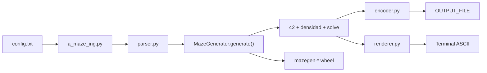
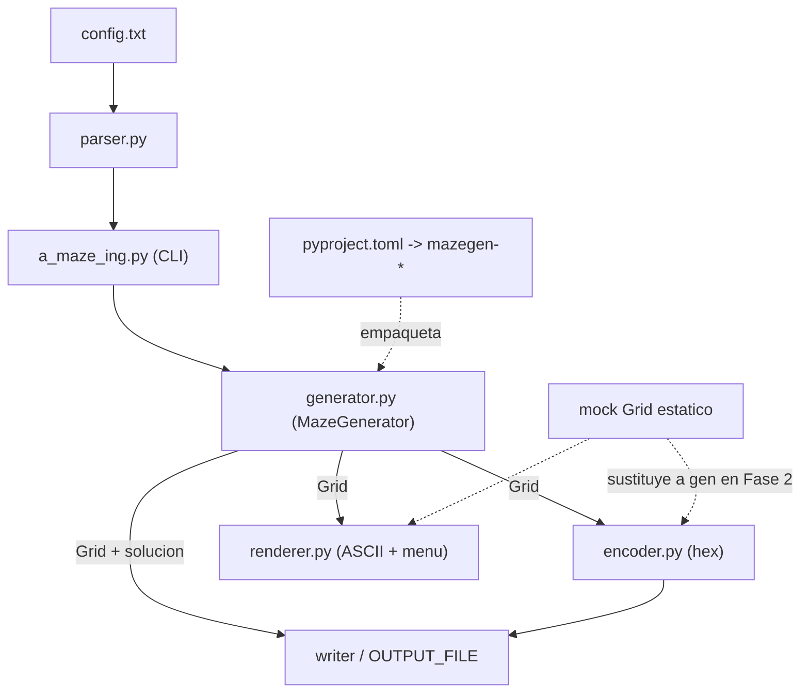
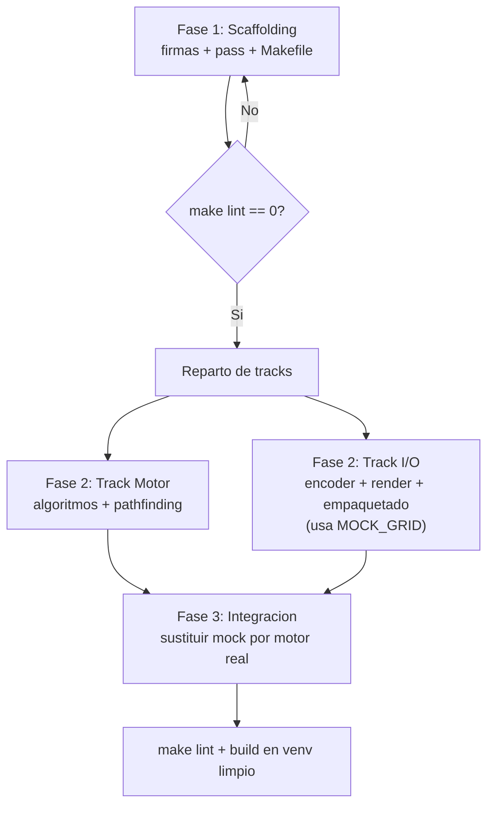
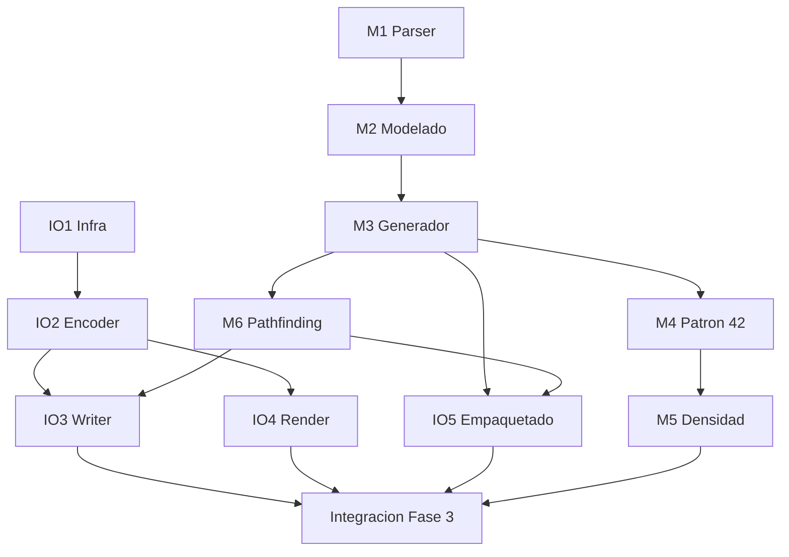

# Hoja de ruta exhaustiva — Proyecto A-Maze-ing (42 Common Core)

> Documento de planificación técnica para el desarrollo del proyecto. Referencia normativa: `en.subject.pdf` (v2.1).
> Las tareas se describen de forma **neutra** (Track Motor / Track I/O); la asignación
> a personas (`alejandr` / `czuluaga`) queda pendiente de decidir y NO se fija aquí.

---

## 0. Cómo usar este documento

1. Lee la sección 1 (requisitos innegociables) antes de escribir una sola línea.
2. Ejecuta la **Fase 1 (Scaffolding)** completa antes de repartir trabajo.
3. Reparte los dos tracks (secciones 6 y 7) y trabaja en paralelo usando el **contrato de interfaces** (sección 3) y datos *mock*.
4. Cierra con la **Fase 3 (Integración)** y el **checklist de defensa** (sección 12).

Cada tarea tiene: ID, objetivo, entrada/salida, criterios de aceptación verificables, dependencias, riesgos y forma de testeo.

---

## Resumen del proyecto y entregables

### Qué se construye

Un **generador de laberintos en Python** que:

1. Lee un fichero de configuración (`config.txt`).
2. Genera un laberinto aleatorio pero **reproducible por semilla**.
3. Opcionalmente lo hace **perfecto** (`PERFECT=True`: un solo camino entre entrada y salida).
4. Incrusta un patrón visual **"42"** con celdas cerradas (o lo omite con mensaje si el mapa es pequeño).
5. Garantiza **conectividad total**, **coherencia bidireccional de muros**, **muros en bordes externos** y **pasillos no más anchos de 2 celdas**.
6. Escribe el resultado en un fichero con codificación **hexadecimal por celda** más metadatos (entrada, salida, ruta óptima).
7. Muestra el laberinto en **terminal ASCII** con menú interactivo.
8. Empaqueta la lógica generadora como módulo reutilizable **`mazegen-*`** instalable con `pip`.

### Artefactos finales esperados en el repositorio

| Artefacto | Ubicación | Obligatorio |
|-----------|-----------|-------------|
| `a_maze_ing.py` | raíz | Sí |
| `config.txt` (por defecto) | raíz | Sí |
| `Makefile` | raíz | Sí |
| `README.md` | raíz | Sí |
| `.gitignore` | raíz | Sí (recomendado fuerte) |
| `pyproject.toml` (+ fuentes de build) | raíz | Sí |
| Paquete `mazegen-*` (`.whl` y `.tar.gz`) | raíz / `dist/` | Sí (generable en evaluación) |
| Módulo `mazegen/` con `MazeGenerator` | `mazegen/` | Sí |
| Tests locales | `tests/` | No (no se entrega/evalúa, pero recomendado) |

### Flujo de datos de alto nivel



---

## 1. Checklist de requisitos innegociables (auditable)

Marca cada casilla solo cuando esté verificada con herramienta, no "a ojo".

### 1.1 Lenguaje y calidad
- [ ] Python **>= 3.10**.
- [ ] Cumple `flake8 .` sin errores.
- [ ] Pasa `mypy . --warn-return-any --warn-unused-ignores --ignore-missing-imports --disallow-untyped-defs --check-untyped-defs` sin errores.
- [ ] **Type hints** en parámetros, retornos **y variables** donde aplique (módulo `typing`).
- [ ] **Docstrings** PEP 257 (estilo Google o NumPy) en funciones y clases.
- [ ] Manejo de excepciones con `try-except`: el programa **nunca crashea**; siempre mensaje de error claro.
- [ ] **Context managers** (`with`) para todo recurso (ficheros).

### 1.2 Ejecución
- [ ] El fichero principal se llama **exactamente** `a_maze_ing.py`.
- [ ] Se ejecuta como `python3 a_maze_ing.py config.txt` (config es el **único** argumento).
- [ ] Errores gestionados: config inválida, fichero no encontrado, sintaxis errónea, parámetros imposibles.

### 1.3 Makefile (reglas obligatorias)
- [ ] `install` — instala dependencias (pip/uv/pipx).
- [ ] `run` — ejecuta el script principal.
- [ ] `debug` — ejecuta con el debugger (`pdb`).
- [ ] `clean` — borra `__pycache__`, `.mypy_cache`, etc.
- [ ] `lint` — ejecuta `flake8 .` **y** `mypy . --warn-return-any --warn-unused-ignores --ignore-missing-imports --disallow-untyped-defs --check-untyped-defs`.
- [ ] `lint-strict` (opcional pero recomendado) — `flake8 .` + `mypy . --strict`.

### 1.4 Empaquetado y repo
- [ ] Paquete reutilizable **`mazegen-*`** en la **raíz** del repo.
- [ ] Genera `.whl` **y** `.tar.gz` con el build estándar (ej. `mazegen-1.0.0-py3-none-any.whl`).
- [ ] La lógica de generación vive en una **clase única** (ej. `MazeGenerator`) en un módulo independiente importable.
- [ ] Existe un `config.txt` **por defecto** en el repo.
- [ ] Existe `.gitignore` para artefactos de Python.
- [ ] `README.md` en la raíz cumpliendo la sección 11.

### 1.5 `config.txt` — formato
- Un par `KEY=VALUE` por línea. Líneas que empiezan por `#` se ignoran.
- Claves **obligatorias**: `WIDTH`, `HEIGHT`, `ENTRY`, `EXIT`, `OUTPUT_FILE`, `PERFECT`.
- Claves opcionales permitidas: `seed`, `algorithm`, `display`, etc.

```text
# config.txt por defecto (ejemplo)
WIDTH=20
HEIGHT=15
ENTRY=0,0
EXIT=19,14
OUTPUT_FILE=maze.txt
PERFECT=True
# opcionales
SEED=42
ALGORITHM=backtracker
```

### 1.6 `OUTPUT_FILE` — especificación milimétrica
1. Matriz de dígitos hexadecimales, **una fila por línea** (un dígito por celda).
2. Tras la última fila: **exactamente una línea vacía**.
3. Luego **3 líneas**, en este orden: coordenadas de `ENTRY`, coordenadas de `EXIT`, y la **ruta más corta** (cadena de `N`/`E`/`S`/`W`).
4. **Todas** las líneas (incluida la vacía y la solución) terminan en `\n`.

Codificación de cada celda (bit a 1 = muro **cerrado**):

| Bit | Dirección | Valor decimal |
|-----|-----------|---------------|
| 0 (LSB) | Norte | 1 |
| 1 | Este | 2 |
| 2 | Sur | 4 |
| 3 | Oeste | 8 |

Ejemplos de coherencia: `3` (`0011`) → Norte+Este cerrados; `A` (`1010`) → Este+Oeste cerrados.

### 1.7 Requisitos del laberinto (IV.4 del subject)

Checklist derivado literalmente del PDF:

- [ ] Generación **aleatoria** con **reproducibilidad por semilla**.
- [ ] Cada celda tiene entre 0 y 4 muros (N, E, S, O).
- [ ] `ENTRY` y `EXIT` existen, son **distintas** y están **dentro de límites**.
- [ ] **Conectividad total**: ninguna celda aislada, **excepto** las del patrón "42".
- [ ] **Muros en todos los bordes externos** del grid.
- [ ] **Coherencia bidireccional**: si `(x,y)` cierra Este, `(x+1,y)` cierra Oeste (y análogo N/S).
- [ ] **Densidad**: pasillos no más anchos de 2 celdas; **nunca** un área abierta 3×3; sí permitido 2×3 o 3×2.
- [ ] Patrón **"42" visible** formado por celdas **totalmente cerradas** (valor hex `F` por celda del patrón).
- [ ] Si el tamaño impide el "42": **mensaje de error en consola** y generación **sin** el patrón (sin crash).
- [ ] `PERFECT=True`: **exactamente un camino** entre entrada y salida (spanning tree).

### 1.8 Representación visual (Cap. V)

- [ ] Render en **ASCII terminal** (opción elegida para este proyecto; el subject también permite MLX).
- [ ] Debe verse claramente: **muros**, **entrada**, **salida**, **ruta solución**.
- [ ] Interacciones mínimas:
  - [ ] Regenerar laberinto y mostrarlo.
  - [ ] Mostrar / ocultar la ruta más corta.
  - [ ] Cambiar colores de muros (ANSI en terminal).
  - [ ] (Opcional) color específico para el patrón "42".
- [ ] Se permiten interacciones extra.

### 1.9 Reutilización del código (Cap. VI)

- [ ] Una **clase única** `MazeGenerator` en módulo standalone importable.
- [ ] Documentación breve de: instanciación, parámetros (tamaño, semilla), acceso a estructura y solución.
- [ ] El formato interno del generador **puede diferir** del formato del fichero de salida.
- [ ] Paquete `mazegen-*` en raíz; build estándar `.whl` + `.tar.gz`.
- [ ] En evaluación: reconstruir e instalar en venv limpio desde fuentes del repo.

---

## 2. Decisiones de diseño previas (acordar antes de codificar)

| Decisión | Opción recomendada | Justificación (para el README) |
|----------|--------------------|--------------------------------|
| Algoritmo de generación | **Recursive Backtracker** (DFS) | Genera *perfect mazes* (spanning tree) de forma simple; fácil de razonar para la defensa. Alternativas: Kruskal/Prim. |
| Estructura de datos | Matriz `list[list[int]]` de 4 bits por celda + helpers | Mapea 1:1 con la salida hex; sencillo de testear. |
| Reproducibilidad | `random.Random(seed)` inyectado | El subject **exige** semilla; nunca usar el `random` global. |
| `PERFECT=True` | Spanning tree puro (1 solo camino) | Requisito directo del subject. |
| `PERFECT=False` | Spanning tree + apertura controlada de muros extra | Mantiene conectividad total sin aislar celdas. |
| Render | ASCII en terminal | Menor coste, sin dependencia externa. El subject también permite MLX. |

> Nota: la entrada y la salida deben ser celdas **distintas**, dentro de límites, y los **bordes externos** deben tener muro.

### 2.1 Dataclass de configuración (contrato del parser)

Definir en `mazegen/parser.py` (o `mazegen/config.py`):

```python
@dataclass(frozen=True)
class MazeConfig:
    width: int
    height: int
    entry: Coord      # (x, y)
    exit: Coord       # (x, y)
    output_file: str
    perfect: bool
    seed: int | None = None
    algorithm: str = "backtracker"  # opcional
```

Función pública: `load_config(path: str) -> MazeConfig` — lanza excepción controlada o retorna error tipado; nunca crash silencioso.

### 2.2 Orquestación de `a_maze_ing.py`

Flujo obligatorio del CLI:

1. Validar `sys.argv` (exactamente 1 argumento: ruta del config).
2. `load_config(path)` dentro de `try-except`.
3. Instanciar `MazeGenerator(width, height, seed=..., perfect=...)`.
4. `generate()` → aplicar patrón "42" → aplicar densidad → `solve(entry, exit)`.
5. Escribir `OUTPUT_FILE` vía encoder/writer.
6. Lanzar render interactivo (menú en bucle).
7. Ante cualquier error: mensaje claro en stderr/stdout y salida limpia (código de salida != 0 si aplica).

---

## 3. Contrato de interfaces entre módulos (clave para paralelizar)

Este contrato permite que el Track I/O trabaje con **datos mock** sin esperar al Track Motor. Fíjalo en la Fase 1 (firmas + `pass`) y **no lo cambies** sin avisar al otro track.

### 3.1 Estructura del laberinto expuesta por `MazeGenerator`

```python
# Tipos compartidos (definir en mazegen/types.py o similar)
Cell = int            # 4 bits de muros: N=1, E=2, S=4, W=8
Grid = list[list[Cell]]   # grid[y][x], filas (y) de arriba a abajo
Coord = tuple[int, int]   # (x, y)
```

`MazeGenerator` debe exponer, como mínimo:

```python
class MazeGenerator:
    def __init__(self, width: int, height: int, *, seed: int | None = None,
                 perfect: bool = True) -> None: ...

    def generate(self) -> None:
        """Genera el laberinto en memoria (idempotente con la misma semilla)."""

    @property
    def grid(self) -> Grid:
        """Matriz de celdas (estado de muros por celda)."""

    def solve(self, entry: Coord, exit_: Coord) -> str:
        """Ruta más corta como cadena de 'N','E','S','W'."""
```

> El subject aclara: el formato interno del módulo **no tiene por qué ser** el del fichero de salida. El encoder (Track I/O) traduce `grid` -> hex.

### 3.2 Diagrama de dependencias entre módulos



### 3.3 Dato mock para desbloquear el Track I/O

```python
# mock 4x3: bordes cerrados, interior abierto (solo para desarrollo de I/O)
MOCK_GRID: Grid = [
    [0b1001, 0b0001, 0b0001, 0b0011],
    [0b1000, 0b0000, 0b0000, 0b0010],
    [0b1100, 0b0100, 0b0100, 0b0110],
]
MOCK_ENTRY = (0, 0)
MOCK_EXIT = (3, 2)
MOCK_PATH = "EEESS"
```

---

## 4. Estructura de ficheros del proyecto

```text
RUTA_AMAZING/
├── a_maze_ing.py          # CLI / punto de entrada
├── config.txt             # configuracion por defecto
├── Makefile
├── pyproject.toml         # build de mazegen-*
├── .gitignore
├── README.md
├── mazegen/
│   ├── __init__.py
│   ├── types.py           # Cell, Grid, Coord
│   ├── parser.py          # lectura/validacion de config
│   ├── generator.py       # MazeGenerator (clase unica)
│   ├── encoder.py         # grid -> hex + formato OUTPUT_FILE
│   └── renderer.py        # ASCII + menu interactivo
└── tests/                 # pytest (no se entrega/evalua, pero ayuda)
```

> Mantener cada módulo por debajo de ~500 líneas; si `generator.py` crece, separar pathfinding y patrón "42" en submódulos internos.

---

## 5. Fases de ejecución



- **Fase 1 (Scaffolding):** crear todos los ficheros con clases, firmas tipadas, docstrings y cuerpos con `pass`. Criterio de salida: `make lint` devuelve **0 errores**.
- **Fase 2 (Paralelo):** cada track implementa su lógica en sesión independiente; el Track I/O usa `MOCK_GRID`.
- **Fase 3 (Integración):** reemplazar mock por el motor real, `make lint`, y construir/instalar el paquete en venv aislado.

### 5.1 Fase 1 — Scaffolding (instrucciones detalladas)

**Objetivo:** crear toda la arquitectura sin lógica algorítmica. Cuerpos de funciones = `pass` únicamente.

**Criterio de salida:** `make lint` → 0 errores.

**Archivos a crear en esta fase:**

| Archivo | Contenido mínimo en Fase 1 |
|---------|---------------------------|
| `a_maze_ing.py` | `main()`, parseo de argv, llamadas stub a parser/generator/encoder/renderer |
| `Makefile` | reglas `install`, `run`, `debug`, `clean`, `lint` |
| `pyproject.toml` | nombre `mazegen`, versión, paquete `mazegen` |
| `mazegen/__init__.py` | exportar `MazeGenerator` |
| `mazegen/types.py` | `Cell`, `Grid`, `Coord` |
| `mazegen/parser.py` | `MazeConfig`, `load_config()` con `pass` |
| `mazegen/generator.py` | clase `MazeGenerator` con firmas de §3.1 |
| `mazegen/encoder.py` | `cell_to_hex()`, `grid_to_lines()`, `write_output_file()` stubs |
| `mazegen/renderer.py` | `render_maze()`, `run_menu_loop()` stubs |
| `config.txt` | ejemplo válido por defecto |
| `.gitignore` | artefactos Python |
| `README.md` | esqueleto con secciones vacías obligatorias |

**Regla `lint` esperada en Makefile:**

```makefile
lint:
	flake8 .
	mypy . --warn-return-any --warn-unused-ignores --ignore-missing-imports \
		--disallow-untyped-defs --check-untyped-defs
```

**Prompt sugerido para Cursor (Agent, Fase 1):** adjuntar `@en.subject.pdf` y pedir el esqueleto con la restricción explícita *"No implementes lógica interna; solo `pass`"*.

### 5.2 Fase 2 — Implementación paralela

- **Track Motor:** implementar M1→M6 en `parser.py` / `generator.py` (y submódulos si hace falta).
- **Track I/O:** implementar IO1→IO4 usando `MOCK_GRID` de §3.3; IO3 puede usar `MOCK_PATH` hasta que M6 exista.
- Ejecutar `make lint` al cerrar cada tarea, no solo al final.

### 5.3 Fase 3 — Integración (checklist)

- [ ] Eliminar o desactivar imports de mock en producción.
- [ ] `a_maze_ing.py` conecta parser → generator real → encoder → writer → renderer.
- [ ] `make lint` sin errores.
- [ ] `python3 a_maze_ing.py config.txt` genera `OUTPUT_FILE` válido.
- [ ] Script de validación del subject pasa sobre el output.
- [ ] `python3 -m venv test_env && pip install build && python -m build`.
- [ ] `pip install dist/mazegen-*.whl` en venv limpio e import funcional.
- [ ] `README.md` completo.

---

## 6. Track Motor (Core y lógica espacial)

### Helpers recomendados (mazegen/walls.py o dentro de generator)

Para no duplicar lógica entre M2, M3, M5 y M6:

```python
def set_wall(grid: Grid, x: int, y: int, direction: str, closed: bool) -> None: ...
def is_open(grid: Grid, x: int, y: int, direction: str) -> bool: ...
def neighbors(x: int, y: int, w: int, h: int) -> list[tuple[int, int, str]]: ...
def check_bidirectional(grid: Grid) -> bool: ...
def flood_fill_connected(grid: Grid, start: Coord) -> set[Coord]: ...
```

---

### M1 — Parser de `config.txt`

- **Objetivo:** leer pares `KEY=VALUE`, ignorar comentarios `#`, convertir tipos y validar.
- **Entrada:** ruta del fichero (`str`).
- **Salida:** instancia `MazeConfig` tipada.
- **Criterios de aceptación:**
  - [ ] Ignora líneas `#` y vacías; tolera espacios alrededor de `=`.
  - [ ] Verifica presencia de las 6 claves obligatorias; error claro si falta alguna.
  - [ ] `WIDTH`/`HEIGHT` enteros > 0; `ENTRY`/`EXIT` parsean a `(x,y)` dentro de límites y **distintos**; `PERFECT` booleano (`True`/`False`, case-insensitive recomendado).
  - [ ] Claves opcionales: `SEED` (int), `ALGORITHM` (str).
  - [ ] Nunca lanza excepción no controlada (todo va por `try-except` con mensaje claro).
- **Dependencias:** ninguna. **Dificultad:** 2/10.
- **Riesgos:** confundir orden `(x,y)` vs `(y,x)`; no validar `ENTRY == EXIT`; claves duplicadas sin política (recomendado: última gana o error).
- **Testeo:** configs válidas, con comentarios, clave faltante, coordenadas fuera de rango, tipos inválidos, fichero inexistente.

---

### M2 — Modelado de la estructura y muros perimetrales

- **Objetivo:** representar el grid en memoria e imponer muros en los bordes externos.
- **Entrada:** `width`, `height`.
- **Salida:** `Grid` inicial coherente (celdas interiores pueden empezar con los 4 muros cerrados o según convención del algoritmo).
- **Criterios de aceptación:**
  - [ ] `grid[y][x]` accesible; dimensiones = `HEIGHT` filas × `WIDTH` columnas.
  - [ ] Celda `(0,y)` tiene muro Norte; `(w-1,y)` muro Este; `(x,0)` muro Oeste en convención del subject — **validar contra el eje usado**: y=0 fila superior → muro Norte en y=0.
  - [ ] Bordes externos siempre con muro cerrado hacia fuera.
  - [ ] Coherencia bidireccional: si celda A cierra Este, su vecina cierra Oeste.
- **Dependencias:** M1. **Dificultad:** 3/10.
- **Riesgos:** convención de ejes invertida (y crece hacia abajo en grid vs pantalla); olvidar un borde.
- **Testeo:** invariante `check_bidirectional(grid)` sobre grid vacío/inicial; assert muros en perimetro.

---

### M3 — Motor de generación (semilla + PERFECT)

- **Objetivo:** generar el laberinto (Recursive Backtracker recomendado) reproducible por semilla.
- **Entrada:** grid inicial de M2, `perfect: bool`, `Random` con semilla.
- **Salida:** grid con pasillos generados.
- **Algoritmo (Recursive Backtracker):**
  1. Elegir celda inicial (ej. `(0,0)` o aleatoria con semilla).
  2. Marcar visitada; mientras haya vecinos no visitados: elegir uno al azar (con `Random`), abrir muro compartido, recursión/DFS.
  3. Resultado con `PERFECT=True`: spanning tree → un único camino entre cualquier par de celdas conectadas.
  4. Con `PERFECT=False`: tras el árbol, abrir un número limitado de muros extra aleatorios manteniendo conectividad (verificar con flood fill).
- **Criterios de aceptación:**
  - [ ] Misma semilla → mismo laberinto (determinista).
  - [ ] `PERFECT=True` → spanning tree (exactamente un camino entre dos celdas).
  - [ ] `PERFECT=False` → conectividad total, sin celdas aisladas.
  - [ ] Mantiene coherencia bidireccional de muros tras generar.
- **Dependencias:** M2. **Dificultad:** 8/10.
- **Riesgos:** usar `random` global; stack overflow en laberintos muy grandes (iterar con pila explícita); romper bordes externos al abrir muros.
- **Testeo:** determinismo con semilla fija; contar aristas = celdas accesibles - 1 en modo perfecto; flood fill = todas las celdas no-"42".

---

### M4 — Inserción del patrón "42" con fallback seguro

- **Objetivo:** superponer el patrón "42" con celdas **completamente cerradas** (`0xF`) e inaccesibles.
- **Entrada:** grid generado, dimensiones.
- **Salida:** grid modificado + flag `pattern_applied: bool`.
- **Implementación sugerida:**
  1. Definir una **plantilla bitmap** del "42" (matriz de celdas que forman el dígito 4 y el 2). Acordar tamaño mínimo (ej. plantilla de N×M celdas).
  2. Calcular posición de anclaje (centrado o esquina inferior; debe ser **visible** en el render ASCII).
  3. Si `width < min_width` o `height < min_height` para la plantilla → `print("Error: maze too small for 42 pattern", file=sys.stderr)` y **return sin modificar**.
  4. Para cada celda del patrón: forzar los 4 muros cerrados (`cell = 0xF`).
  5. Re-ejecutar flood fill desde `ENTRY` excluyendo celdas "42"; verificar que `EXIT` sigue alcanzable.
- **Criterios de aceptación:**
  - [ ] El "42" es visible en ASCII y formado por celdas con valor `F`.
  - [ ] **Regla de excepción:** mapa pequeño → mensaje en consola, generación continúa **sin** patrón. No crash.
  - [ ] Tras insertar, `ENTRY`→`EXIT` siguen conectados evitando celdas "42".
- **Dependencias:** M3. **Dificultad:** 6/10.
- **Riesgos:** patrón bloquea único camino; plantilla demasiado grande; olvidar re-validar pathfinding.
- **Testeo:** mapa 20×15 (con "42"), mapa 3×3 (mensaje + sin patrón), pathfinding post-inserción.

---

### M5 — Restricción de densidad (ancho de pasillo <= 2)

- **Objetivo:** impedir áreas abiertas de 3×3 o más; corregir cerrando muros quirúrgicamente.
- **Entrada:** grid post-generación y post-"42".
- **Salida:** grid corregido.
- **Algoritmo sugerido:**
  1. Definir "celda abierta" como celda no-"42" donde existe al menos una dirección sin muro hacia otra celda abierta (o usar definición de "espacio libre" del subject: zona sin muro interior).
  2. Escanear ventanas deslizantes 3×3; si las 9 celdas forman zona prohibida, cerrar **un** muro interior mínimo que rompa el 3×3.
  3. Tras cada cierre: `check_bidirectional` + flood fill desde `ENTRY`.
  4. Repetir hasta no detectar 3×3 o límite de iteraciones.
- **Criterios de aceptación:**
  - [ ] No existe ventana 3×3 totalmente abierta. Permitido 2×3 y 3×2.
  - [ ] Al cerrar muros, **no se aísla** ninguna celda accesible.
  - [ ] `ENTRY`→`EXIT` siguen conectados.
- **Dependencias:** M3, M4. **Dificultad:** 7/10.
- **Riesgos:** definición incorrecta de "abierto"; cerrar muro que aísla región; bucle infinito sin límite de iteraciones.
- **Testeo:** detector 3×3 = 0 en grid final; conectividad intacta; casos 2×3 permitidos no tocados.

---

### M6 — Solucionador / Pathfinding

- **Objetivo:** ruta más corta `ENTRY`→`EXIT`, traducida a `N`/`E`/`S`/`W`.
- **Entrada:** grid final, `entry`, `exit`.
- **Salida:** `str` (ej. `"NEESSW"`).
- **Algoritmo:** BFS (suficiente en grid sin pesos; más simple de defender que A*).
  1. Cola BFS desde `entry`; vecinos accesibles si no hay muro entre celdas y celda destino no es "42" cerrada.
  2. Reconstruir camino; convertir deltas: `(0,-1)→N`, `(1,0)→E`, `(0,1)→S`, `(-1,0)→W` (ajustar según convención y=0 arriba).
- **Criterios de aceptación:**
  - [ ] Devuelve la **más corta**; en `PERFECT=True` es única.
  - [ ] Traducción de vectores correcta.
  - [ ] Si no hay camino: mensaje claro, no crash.
- **Dependencias:** M3. **Dificultad:** 6/10.
- **Riesgos:** invertir N/S por convención de y; incluir celdas "42" en el camino; no excluir muros bidireccionales.
- **Testeo:** laberinto manual 4×4 con solución conocida; comparar longitud con BFS de referencia.

---

## 7. Track I/O, Interfaz y Empaquetado

### IO1 — Infraestructura base

- **Objetivo:** estructura de carpetas, `Makefile`, `.gitignore`, esqueleto `README.md`, esqueleto `pyproject.toml`.
- **Entrada:** repo vacío.
- **Salida:** proyecto que pasa `make lint` con stubs.
- **Criterios de aceptación:**
  - [ ] `make install`, `make run`, `make clean`, `make debug`, `make lint` definidos.
  - [ ] `lint` usa los flags exactos de §1.3.
  - [ ] `.gitignore` excluye `__pycache__/`, `.mypy_cache/`, `build/`, `dist/`, `*.egg-info/`, `.venv/`, `test_env/`.
  - [ ] `run` ejecuta `python3 a_maze_ing.py config.txt` (o equivalente).
- **Dependencias:** ninguna. **Dificultad:** 3/10.
- **Riesgos:** flags mypy incorrectos; olvidar `clean` de caches que rompen CI local.
- **Testeo:** `make lint` sobre esqueleto = 0 errores.

---

### IO2 — Codificador bitwise → hex

- **Objetivo:** traducir cada celda del `Grid` a un dígito hexadecimal según §1.6 (N=1, E=2, S=4, W=8).
- **Entrada:** `Cell` (int 0–15) o `Grid`.
- **Salida:** `str` de un carácter hex (`0`–`F`, mayúsculas recomendadas).
- **Implementación:**

```python
def cell_to_hex(cell: Cell) -> str:
    return format(cell & 0xF, "X")  # '0'..'F'

def grid_to_hex_lines(grid: Grid) -> list[str]:
    return ["".join(cell_to_hex(c) for c in row) for row in grid]
```

- **Criterios de aceptación:**
  - [ ] N=1, E=2, S=4, W=8; muro cerrado = bit 1.
  - [ ] Salida consistente en mayúsculas (como ejemplo `A` del subject).
  - [ ] Función pura, testeable con `MOCK_GRID`.
- **Dependencias:** contrato §3.1. **Dificultad:** 4/10.
- **Riesgos:** invertir bits; usar minúsculas inconsistentes; no enmascarar con `& 0xF`.
- **Testeo:** parametrizar los 16 valores 0..F; golden test con `MOCK_GRID`.

---

### IO3 — Escritor del `OUTPUT_FILE`

- **Objetivo:** escribir el fichero con el formato milimétrico de §1.6.
- **Entrada:** `grid`, `entry`, `exit`, `path`, `output_path`.
- **Salida:** fichero en disco.
- **Formato exacto de las 3 líneas finales** (tras la línea vacía):

```text
<x_entry>,<y_entry>
<x_exit>,<y_exit>
NESW...
```

Ejemplo completo (laberinto 2×2 ficticio):

```text
F3F3
F3F3

0,0
1,1
EES
```

- **Criterios de aceptación:**
  - [ ] Matriz fila por fila; **una** línea vacía; luego ENTRY, EXIT, ruta.
  - [ ] **Todas** las líneas terminan en `\n` (incluida la vacía y la última).
  - [ ] Uso de `with open(...)`.
  - [ ] Pasa el **script de validación** del subject.
- **Dependencias:** IO2, M6 (ruta). **Dificultad:** 3/10.
- **Riesgos:** olvidar `\n` en línea vacía; formato coordenadas distinto al esperado por Moulinette; escribir path vacío sin manejar error.
- **Testeo:** diff byte a byte; `xxd` o script Python que verifique último byte = `\n` en cada línea.

---

### IO4 — Renderizador ASCII + menú interactivo

- **Objetivo:** dibujar el laberinto con caracteres de bloque y ofrecer menú cíclico.
- **Entrada:** `grid`, `entry`, `exit`, `path`, callbacks de regeneración.
- **Salida:** visualización en terminal + bucle de interacción.
- **Render sugerido:** cada celda ocupa espacio ampliado; muros con `██` o `#`; entrada `E`, salida `X`, camino `.` o color ANSI.
- **Menú mínimo (opciones 1–4):**

| Opción | Acción |
|--------|--------|
| 1 | Regenerar laberinto (nueva semilla o incrementar seed) |
| 2 | Mostrar / ocultar solución |
| 3 | Alternar paleta de colores ANSI de muros |
| 4 | Salir |

- **Criterios de aceptación:**
  - [ ] Muestra muros, entrada, salida y solución claramente.
  - [ ] Las 4 interacciones mínimas del subject funcionan.
  - [ ] Inputs inválidos no crashean.
- **Dependencias:** contrato §3.1. **Dificultad:** 5/10.
- **Riesgos:** confundir coordenadas pantalla vs grid; ANSI no soportado en terminal Windows (considerar fallback); menú infinito sin opción salir.
- **Testeo:** manual con `MOCK_GRID`; inputs `"abc"`, `""`, `"99"`.

---

### IO5 — Empaquetado `mazegen-*`

- **Objetivo:** `pyproject.toml` que aísle el motor y construya `.whl` + `.tar.gz`.
- **Entrada:** fuentes en `mazegen/`.
- **Salida:** `dist/mazegen-<ver>-py3-none-any.whl` y `.tar.gz`.
- **Contenido mínimo `pyproject.toml`:**

```toml
[project]
name = "mazegen"
version = "1.0.0"
requires-python = ">=3.10"

[build-system]
requires = ["setuptools>=61"]
build-backend = "setuptools.build_meta"

[tool.setuptools.packages.find]
where = ["."]
include = ["mazegen*"]
```

- **Criterios de aceptación:**
  - [ ] `python -m build` genera ambos artefactos.
  - [ ] Instalable e importable en venv limpio.
  - [ ] Documentación de uso en README (ejemplo mínimo).
- **Dependencias:** M3, M6 (API estable). **Dificultad:** 6/10.
- **Riesgos:** empaquetar `a_maze_ing.py` dentro del wheel (debe ser solo el módulo reutilizable); versión hardcodeada desincronizada.
- **Testeo:** script de verificación en Fase 3 §5.3.

---

## 8. Tabla resumen de tareas y dependencias

| ID | Track | Tarea | Depende de | Dificultad |
|----|-------|-------|-----------|------------|
| M1 | Motor | Parser config | — | 2/10 |
| M2 | Motor | Modelado + bordes | M1 | 3/10 |
| M3 | Motor | Generación + semilla + PERFECT | M2 | 8/10 |
| M4 | Motor | Patrón "42" + fallback | M3 | 6/10 |
| M5 | Motor | Densidad <=2 | M3, M4 | 7/10 |
| M6 | Motor | Pathfinding | M3 | 6/10 |
| IO1 | I/O | Infraestructura/Makefile | — | 3/10 |
| IO2 | I/O | Encoder hex | §3.1 | 4/10 |
| IO3 | I/O | Escritor OUTPUT_FILE | IO2, M6 | 3/10 |
| IO4 | I/O | Render ASCII + menú | §3.1 | 5/10 |
| IO5 | I/O | Empaquetado mazegen-* | M3, M6 | 6/10 |

Ruta crítica: **M2 -> M3 -> M4 -> M5** (y M3 -> M6). IO1/IO2/IO4 arrancan en paralelo con `MOCK_GRID`.

---

## 9. Estrategia de testing (no se entrega, pero protege la defensa)

Framework: **pytest** (recomendado). Carpeta `tests/`.

### 9.1 Estructura sugerida de tests

```text
tests/
├── conftest.py           # MOCK_GRID, fixtures
├── test_parser.py        # M1
├── test_walls.py         # M2 coherencia bidireccional
├── test_generator.py     # M3 determinismo, perfect
├── test_pattern42.py     # M4 fallback
├── test_density.py       # M5 no 3x3
├── test_pathfinding.py   # M6
├── test_encoder.py       # IO2 tabla 0..F
├── test_output_file.py   # IO3 formato byte-exact
└── test_integration.py   # flujo completo con config pequeña
```

### 9.2 Casos límite obligatorios

- [ ] Config: falta una clave / sintaxis mala / coordenadas fuera de límites / `ENTRY==EXIT`.
- [ ] Fichero de config inexistente → mensaje claro, sin crash.
- [ ] Mapa demasiado pequeño para "42" → mensaje + laberinto sin patrón.
- [ ] Coherencia bidireccional de muros sobre todo el grid (`check_bidirectional`).
- [ ] `PERFECT=True` → exactamente un camino (árbol: #aristas = #celdas - componentes).
- [ ] No existe ventana 3×3 abierta.
- [ ] Determinismo: `generate()` dos veces con misma semilla → grids idénticos.
- [ ] `OUTPUT_FILE` pasa el **script de validación** del subject.
- [ ] Pathfinding: camino respeta muros (no atraviesa paredes).
- [ ] Regenerar desde menú produce laberinto distinto (semilla distinta).

### 9.3 Script de validación del subject

El PDF indica que se proporciona un script de validación con el subject. **Localizarlo en los materiales de 42** y ejecutarlo en CI local antes de entregar:

```bash
python3 a_maze_ing.py config.txt
python3 <validation_script>.py config.txt maze.txt
```

Si no está en el repo, descargarlo del intranet/subject bundle y documentar su uso en el README.

### 9.4 Entorno de desarrollo

- Crear `venv` o `conda` aislado.
- `make install` instala dependencias de desarrollo (`flake8`, `mypy`, `pytest`, `build`).
- Ejecutar `make lint` y `pytest` antes de cada commit relevante.

---

## 10. Riesgos y fallos típicos de auditoría

| Riesgo | Mitigación |
|--------|-----------|
| Bits invertidos o valor de Oeste incorrecto (debe ser 8) | Test de tabla de verdad 0..F en IO2 |
| Olvidar `\n` final o la línea vacía | Test byte a byte + script de validación |
| Crash ante input/config inválida | `try-except` + mensajes claros; test de inputs malos |
| Patrón "42" lanza excepción en mapas pequeños | Implementar fallback de M4 con test dedicado |
| Aislar celdas al corregir densidad (M5) | Re-verificar conectividad tras cada cierre de muro |
| Usar `random` global (no reproducible) | Inyectar `random.Random(seed)` |
| No poder reconstruir el paquete en la defensa | Probar build+install en venv limpio antes de entregar |
| `mypy`/`flake8` fallan al integrar | `make lint` al final de cada tarea, no solo al final |

---

## 11. Requisitos del `README.md`

Debe incluir, **como mínimo**:

- [ ] **Primera línea en cursiva**, literal: *This project has been created as part of the 42 curriculum by &lt;login1&gt;[, &lt;login2&gt;...]*.
- [ ] Sección **Description** (objetivo + visión general).
- [ ] Sección **Instructions** (instalación, compilación, ejecución).
- [ ] Sección **Resources** (referencias clásicas **y** descripción de cómo se usó la IA: para qué tareas y qué partes).
- [ ] Estructura y formato completo del `config.txt`.
- [ ] Algoritmo de generación elegido **y por qué**.
- [ ] Qué parte del código es reutilizable y **cómo** (uso del paquete `mazegen-*` con ejemplo mínimo: instanciar, pasar parámetros/semilla, acceder a la estructura y a una solución).
- [ ] Gestión de equipo: roles, planificación anticipada y su evolución, qué funcionó / qué mejorar, herramientas usadas.
- [ ] Idioma: inglés recomendado (o el del campus).

---

## 12. Preparación para la defensa / peer-evaluation (Cap. IX)

- [ ] Todo el código que se presenta debe **entenderse y justificarse** (la rúbrica de IA penaliza copiar sin comprender).
- [ ] Estar listos para una **modificación en vivo** (cambiar una función, un display o una estructura de datos en pocos minutos).
- [ ] Ensayar: regenerar con otra semilla, cambiar tamaño, alternar `PERFECT`, mostrar/ocultar solución.
- [ ] Reconstruir el paquete `mazegen-*` desde fuentes en un venv limpio delante del evaluador.
- [ ] Revisión por pares previa (peer review) de las partes complejas (M3, M5).

---

## 13. Orden de trabajo recomendado (resumen accionable)

1. **IO1** (infra + Makefile) y **M1** (parser) en paralelo.
2. `make lint` a cero sobre el esqueleto (Fase 1 cerrada).
3. Track I/O arranca **IO2 + IO4** con `MOCK_GRID`; Track Motor arranca **M2 -> M3**.
4. Motor: **M6** (pathfinding) en cuanto M3 esté; luego **M4** y **M5**.
5. I/O: **IO3** (necesita IO2 + ruta de M6) e **IO5** (necesita API estable).
6. **Fase 3:** sustituir mock por motor real, `make lint`, build+install en venv.
7. Completar `README.md` y ensayar la defensa.

---

## 14. Diagrama de dependencias entre tareas (Gantt lógico)



---

## 15. Criterios de "proyecto terminado"

Marca **todas** antes de considerar el proyecto listo para evaluación:

- [ ] `make lint` → 0 errores.
- [ ] `make run` genera laberinto y abre menú interactivo.
- [ ] `OUTPUT_FILE` válido según script de validación.
- [ ] Patrón "42" visible en mapa estándar (20×15); fallback en mapa pequeño.
- [ ] `PERFECT=True` y `PERFECT=False` ambos funcionan.
- [ ] Paquete `mazegen-*` build + install en venv limpio.
- [ ] `README.md` completo con uso de IA documentado.
- [ ] Ambos miembros del equipo pueden explicar M3, M5 e IO3 en la defensa.
