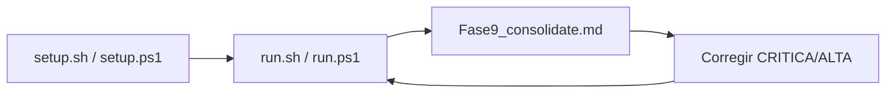

# Auditoría A-Maze-ing

Herramienta **local** para comprobar el proyecto contra el subject [`en.subject.pdf`](../en.subject.pdf) (v2.1). **No modifica el código del entregable**: solo ejecuta pruebas, genera configs temporales y escribe informes en Markdown.

Referencia normativa del plan de fases: ver sección [Fases de la auditoría](#fases-de-la-auditoría) (basado en el plan acordado del equipo).

---

## Qué busca esta auditoría

Comprueba que el laberinto cumple lo exigido en la evaluación 42:

| Área | Qué se verifica |
|------|-----------------|
| Calidad (III.1) | `flake8`, `mypy`, docstrings, manejo de errores |
| Config (IV.3) | Claves obligatorias, validación, mensajes sin crash |
| Laberinto (IV.4) | SEED, PERFECT, patrón 42, conectividad, densidad M5 |
| Output (IV.5) | Formato hex, metadatos, `output_validator.py` |
| CLI (IV.2, V) | Menú interactivo, regenerar, path, colores |
| Paquete (VI) | Build `mazegen-*.whl` + `.tar.gz` |

**Fuera de alcance** (solo se mencionan como WARN): Makefile/README incompletos, nombre `config.txt` vs `config_maze.txt`.

---

## Estructura de carpetas

```text
audit/
├── README.md           ← este archivo
├── run_audit.py        ← motor: ejecuta las 9 fases y escribe informes
├── setup.sh / setup.ps1   ← crea audit/.venv e instala deps
├── run.sh / run.ps1       ← atajo para lanzar la auditoría
├── .venv/              ← entorno Python (no se sube a git)
├── .gitignore
├── configs/            ← configs de prueba (parser, seeds 1–10)
├── outputs/            ← laberintos generados en Fase 6 (regenerables)
└── reports/            ← informes Markdown por fase + resumen final
    ├── Fase0_bootstrap.md
    ├── Fase1_lint.md
    ├── …
    └── Fase9_consolidate.md   ← **empezar aquí**
```

---

## Requisitos

- Python **≥ 3.10**
- En **Linux 42**: `python3`, terminal UTF-8 (recomendado para evaluación)
- En **Windows**: `python` (PowerShell); la auditoría fuerza `PYTHONIOENCODING=utf-8` en subprocesos

---

## Instalación (una vez)

Desde la raíz del repo `amazing/`:

**Linux / 42 / macOS**

```bash
cd audit
chmod +x setup.sh run.sh
./setup.sh
```

**Windows (PowerShell)**

```powershell
cd audit
.\setup.ps1
```

Esto crea `audit/.venv`, instala `flake8`, `mypy`, `build` y el paquete `mazegen` en editable (`pip install -e ..`).

---

## Ejecución

**Linux / 42**

```bash
cd audit
./run.sh
```

**Windows**

```powershell
cd audit
.\run.ps1
```

**Manual (cualquier SO)**

```bash
cd audit
# Linux:
.venv/bin/python run_audit.py
# Windows:
.venv\Scripts\python.exe run_audit.py
```

Duración aproximada: **10–15 s**. Al terminar:

```text
Informes en: audit/reports/
Resumen:     audit/reports/Fase9_consolidate.md
```

---

## Qué sale / dónde leerlo

### 1. Resumen ejecutivo

Abrir **[`reports/Fase9_consolidate.md`](reports/Fase9_consolidate.md)**:

- Veredicto global (apto / no apto para evaluación)
- Matriz PASS/FAIL por requisito del subject
- Tabla de hallazgos **CRITICA / ALTA** (prioridad defensa)
- Enlaces a informes por fase

### 2. Detalle por fase

Cada `reports/FaseN_*.md` sigue la misma plantilla:

| Sección | Contenido |
|---------|-----------|
| **Estado** | `PASS`, `FAIL` o `WARN` |
| **Comandos ejecutados** | Qué se lanzó |
| **Evidencia** | Salidas, métricas, rutas de ficheros |
| **Hallazgos** | ID, severidad, descripción, archivo, reproducción |
| **Requisitos** | Qué apartados del PDF cubre o no |

### 3. Artefactos generados

| Ruta | Descripción |
|------|-------------|
| `configs/valid.txt`, `missing_width.txt`, … | Casos P1–P8 del parser |
| `configs/seed_1.txt` … `seed_10.txt` | 10 laberintos (PERFECT alternado) |
| `outputs/maze_1.txt` … `maze_10.txt` | OUTPUT_FILE de Fase 6 |
| `../dist/mazegen-*` | Wheel/tar.gz creados en Fase 8 (en raíz del repo) |

Los `outputs/*.txt` están en `.gitignore`; los informes `reports/` **sí** conviene commitearlos tras cada auditoría para comparar con el compañero.

---

## Fases de la auditoría

| Fase | Archivo | Qué hace |
|------|---------|------------|
| 0 | `Fase0_bootstrap` | Documenta venv e imports (manual + setup) |
| 1 | `Fase1_lint` | `flake8` + `mypy` (flags del subject) |
| 2 | `Fase2_parser` | 8 configs válidas/inválidas contra `parser.py` |
| 3 | `Fase3_coords` | Bitmask hex, coords (x,y), coherencia path NESW |
| 4 | `Fase4_generator` | SEED, PERFECT, patrón 42, conectividad, M5, recursion |
| 5 | `Fase5_solver` | BFS óptimo, formato output, crash sin camino |
| 6 | `Fase6_output` | 10 runs + `output_validator.py` oficial |
| 7 | `Fase7_cli` | Menú, argv, regenerar, inputs inválidos |
| 8 | `Fase8_packaging` | `python -m build`, import API `mazegen` |
| 9 | `Fase9_consolidate` | Cruza todo y prioriza fixes |

---

## Severidades

| Nivel | Significado |
|-------|-------------|
| **CRITICA** | Crash, moulinette fallida o requisito obligatorio incumplido → **arreglar antes de evaluar** |
| **ALTA** | Comportamiento incorrecto en casos normales de evaluación |
| **MEDIA** | Edge case o deuda que puede salir en defensa |
| **BAJA** | Estilo, naming, mejoras opcionales |

---

## Hallazgos actuales (última auditoría)

Ver detalle completo en [`Fase9_consolidate.md`](reports/Fase9_consolidate.md). Resumen:

**Críticos / altos pendientes**

| ID | Problema |
|----|----------|
| G6 | Laberinto pequeño: no se imprime error al omitir patrón 42 |
| G5b | Restricción de densidad (M5) no implementada |
| S4 | `get_directions()` lanza excepción si no hay camino |
| G9 | Segunda `generate()` desplaza el patrón 42 |
| U3 | Opción 1 del menú no reescribe `OUTPUT_FILE` |
| L2 | `mypy` falla (`setup_new_maze` sin return type) |
| ALG | `ALGORITHM` en config no se usa |

**Qué ya pasa bien**

- Parser (P1–P8), determinismo SEED, validador 10/10, patrón 42 en 12×12, conectividad 20×15, build pip, formato hex.

Tras corregir código, **vuelve a ejecutar** `./run.sh` o `.\run.ps1` y compara el nuevo `Fase9_consolidate.md`.

---

## Flujo recomendado para el equipo



1. Uno ejecuta la auditoría y sube `audit/reports/` al repo (o comparte el diff).
2. Repartís fixes por ID (G6 → generator, S4 → solver, etc.).
3. Re-auditáis hasta que `Fase9` marque apto en los puntos bloqueantes.

---

## Notas importantes

- **No sustituye la moulinette** ni la defensa; complementa con pruebas repetibles.
- **`output_validator.py`** sigue en la raíz del repo (script del subject); la auditoría lo invoca pero no lo mueve.
- **Windows vs Linux**: el crash por `UnicodeEncodeError` con `█` en `print_maze` es típico de consola cp1252; en Linux 42 suele no aparecer. Fase 6 valida el fichero de salida **antes** del menú, aunque falle el render.
- **Regenerar venv**: borrar `audit/.venv` y ejecutar de nuevo `setup.sh` / `setup.ps1`.

---

## Preguntas frecuentes

**¿Puedo ejecutar solo una fase?**  
Ahora mismo `run_audit.py` ejecuta todas. Para una fase concreta:

```bash
cd audit
.venv/bin/python -c "import run_audit as r; r.phase4_generator()"
# Ajusta el nombre de la función (phase2_parser, phase6_output, …)
```

**¿Commiteo `audit/.venv`?**  
No. Está en `.gitignore`. Cada uno ejecuta `setup`.

**¿Commiteo `audit/outputs/`?**  
Opcional. Son regenerables; `.gitignore` ignora los `.txt`.

**¿Modifica mi `maze.txt` de la raíz?**  
Fase 7 puede tocar `maze.txt` si usas `config_maze.txt` con `OUTPUT_FILE=maze.txt`. Fase 6 escribe en `audit/outputs/`.
